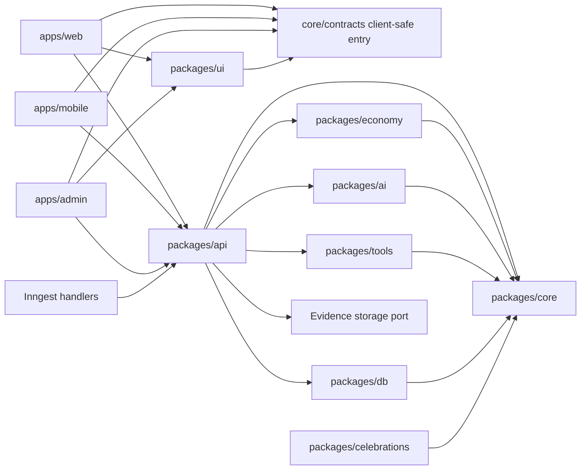
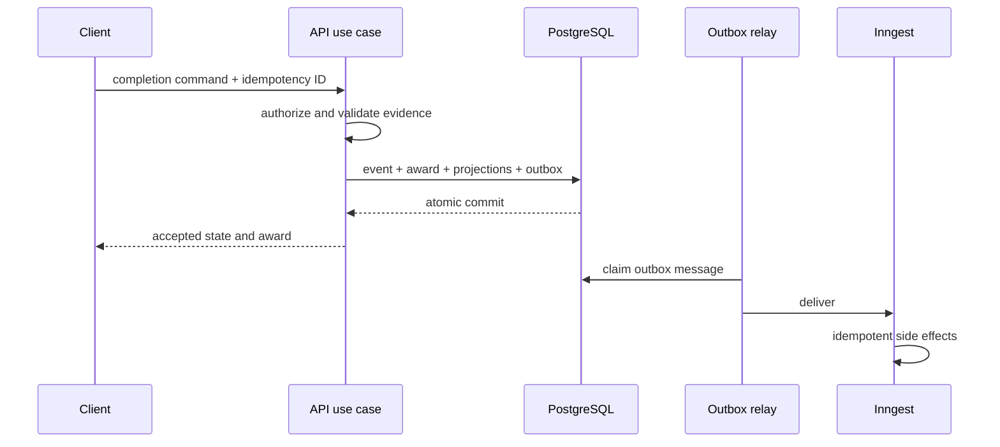
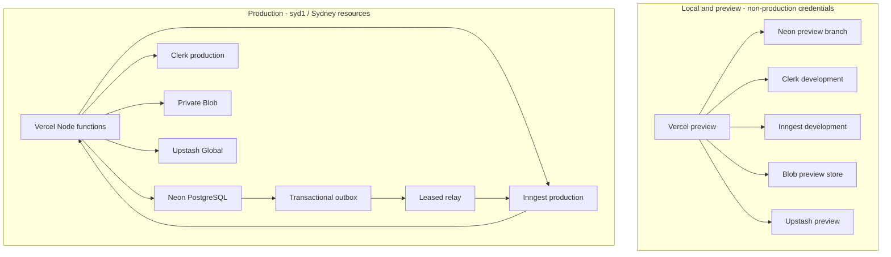

# Architecture Spine — Zandegi

## Design Paradigm

Zandegi is a modular monolith with a pure functional core, an application-layer imperative shell, and event sourcing bounded to earned progression and spendable economy facts. Authored content, missions, schedules, identities, provider references, and operational records are conventional relational state.



## Invariants & Rules

### AD-1 — Bounded event-sourced modular monolith [ADOPTED]

- **Binds:** goals, missions, steps, completion, progression, economy, schedules
- **Prevents:** applying event-sourcing complexity to every record or mutating earned state as ordinary CRUD
- **Rule:** Completion, verified effort, XP, levels, ranks, domain stats, streaks, trust, Shards, Crowns, and their corrections are immutable ledger facts with replayable projections. Goals, Pursuits, Missions, Chapters, Steps, Blocks, identity links, subscription references, and generated content are authoritative relational records. Audit/outbox messages never become authoritative merely because they are called events.

### AD-2 — One application boundary and explicit package ownership [ADOPTED]

- **Binds:** all apps, jobs, and packages
- **Prevents:** entry points ordering workflows differently and packages competing for business-rule ownership
- **Rule:** `@zandegi/api` owns authorization, use cases, orchestration, and transaction boundaries. `core` exclusively owns progression formulas, progression tuning, safety contracts, client-safe shared schemas, and ledger contracts. `economy` owns only currency, commerce, entitlement, and economy tuning. `db` implements persistence and the Unit of Work. `ai` returns validated content only. `tools` returns pure transitions and candidate verified facts only. Apps and jobs call API use cases; apps may import only `@zandegi/core/contracts`, `@zandegi/api/client`, and their presentation packages. No app imports `ai`, `db`, server-only core policy, `economy`, or `tools`; no capability or infrastructure package imports `api`.

### AD-3 — Versioned ledger and historically reproducible awards [ADOPTED]

- **Binds:** event producers, event consumers, projection rebuilds, scoring changes
- **Prevents:** incompatible payloads, duplicate awards, unreadable history, and replay changing past rewards
- **Rule:** `core` publishes a discriminated `LedgerEnvelopeV1` and event registry with exact field names, scalar/size/nullability rules, JSON fixtures, and a canonical payload hash. The envelope includes event ID, aggregate ID, monotonic aggregate sequence, event type, schema version, subject reference, principal reference, `occurredAt`, server `recordedAt`, correlation ID, causation ID, and idempotency key. Only API use cases append through the DB-owned ledger port, which revalidates the value at the persistence boundary. Rebuilds order by aggregate sequence, never timestamps. Unknown/corrupt versions quarantine and stop only the affected aggregate while other aggregates continue. Upcasters are pure shape transformations and cannot call clocks, current calculators, databases, or providers. Corrections use typed compensation events with `correctsEventId`; a fact cannot be corrected twice. Every award stores accepted inputs, breakdown, amount, calculator version, and progression-policy version. Ledger payloads contain opaque references and minimal facts, never raw goals, mission bodies, provider payloads, or file contents.

### AD-4 — Atomic earned state and transactional outbox [ADOPTED]

- **Binds:** completion, awards, immediate projections, background effects
- **Prevents:** stale earned state, partial awards, duplicate effects, and a side-effect outage blocking real work
- **Rule:** API executes earning commands through `db.UnitOfWork.run`, which supplies transaction-scoped repositories without exposing Prisma types. The command key is unique by principal plus operation plus client key and stores a canonical request hash and response; reuse with different input returns a stable conflict. One PostgreSQL transaction locks or version-checks the affected aggregate, assigns its next sequence, evaluates synchronous risk, appends ledger facts, writes `XpAward`, updates permitted immediate projections, and inserts `OutboxMessageV1`. Serializable/constraint conflicts retry with a bounded policy; no repository opens a nested autonomous transaction. Provisional awards are visible as pending but do not update spendable balance, rank, streak, leaderboard, or celebrations until a typed promotion event; rejection uses a typed reversal. An Inngest cron-triggered API relay claims rows with a lease and `FOR UPDATE SKIP LOCKED`, delivers a stable message/dedupe ID, and acknowledges only after Inngest accepts it. Poison messages enter a replayable dead-letter state. Handlers accept a signed, least-privilege system `ActorContext`, remain Postgres-idempotent beyond provider dedupe windows, and never join the earning transaction.



### AD-5 — Models and money never determine progression [ADOPTED]

- **Binds:** generation, tools, verification, XP, billing, entitlements, competitive features
- **Prevents:** pay-to-progress, tap farming, and model-authored reward values
- **Rule:** AI-produced duration, difficulty, priority, and rarity fields are planning hints only and no pre-completion numeric XP promise is shown. `core` defines exhaustive `AwardEvidenceKind = SELF | TIMER | ARTIFACT | METRIC | INTEGRATION`: SELF uses the fixed neutral completion policy; TIMER uses bounded server-observed active time; ARTIFACT uses the server-authored reward band after evidence verification; METRIC uses the registered server-side metric policy; and INTEGRATION awards nothing until a provider-specific attestation policy is approved after MVP. UI actions such as check, capture, or tool completion map to exactly one evidence kind; tools may produce TIMER, ARTIFACT, or METRIC facts but do not create new kinds. These inputs and all caps live in versioned core progression policy; model estimates never enter the calculator. Merely opening or using a tool is not rewardable. Purchases, subscriptions, Crew Boosts, and purchasable currency cannot increase XP, repair streaks, change rank, or improve leaderboard position. All clients call one server-side entitlement evaluator.

### AD-6 — Safety, age, and content release are server-enforced [ADOPTED]

- **Binds:** guest and account generation, mission content, under-18 commerce/social access
- **Prevents:** restricted content, unsafe partial streams, and UI-only safety gates
- **Rule:** `core` defines deterministic policy; API enforces account, age, and under-18 restrictions; AI performs pre-generation routing and fail-closed post-generation grounding/safety checks. Only individually validated chapters may stream—raw model output never does. Self-harm-adjacent requests route to support; clinical, eating-risk, financial, and legal boundaries remain mandatory. A guest requesting an age-restricted pursuit must pass the minimum age gate before restricted generation, and account claim cannot weaken the resulting policy.

### AD-7 — Server-owned guest identity and one-time claim [ADOPTED]

- **Binds:** value-before-signup onboarding, first XP, Clerk signup
- **Prevents:** fake first XP, browser-owned identity, duplicate claims, and lost pre-signup progress
- **Rule:** API creates an internal guest principal bound to a hashed, expiring, rotating token in a secure, same-site, HTTP-only cookie with origin/CSRF checks. Guest missions and eligible actions use normal persistence and ledger paths. Claim is an idempotent Unit-of-Work command: a new account attaches its Clerk identity to the guest principal; an existing account becomes the canonical principal and the guest becomes an immutable alias whose streams are combined during projection rebuild while claimable relational ownership transfers under explicit conflict rules. Claim rotates the cookie; in-flight commands resolve to the canonical principal or return a retryable conflict. The guest retention period, renewal events, warning, cleanup, and evidence treatment must be fixed in a feature specification before the Phase 4 schema freezes. Clients never submit trusted totals or ownership identifiers.

### AD-8 — Versioned content pipeline with request-scoped generation [ADOPTED]

- **Binds:** Pursuits, knowledge, Mission generation, source validation, streaming
- **Prevents:** AI owning persistence, unsourced facts, abandoned inference spend, and incompatible content versions
- **Rule:** `core` owns Pursuit, `KnowledgeSnapshot`, `FreshnessDecision`, generated-content, and versioned generation-stream schemas; `db` owns versioned Pursuit, candidate, knowledge, and Mission records; admin workflows author and approve catalog content. API supplies one clock instant and only freshness-approved sources; AI returns validated drafts and owns no clock, identity, transaction, or ledger append. The SSE protocol has a run ID, ordered validated-chapter frames, one terminal frame, and explicit error/cancel frames; released chapters are previews until the terminal accepted result. Generation is request-scoped with an application deadline below the host deadline. Disconnect aborts before acceptance begins; after the acceptance transaction starts it finishes, and the same idempotency key discovers the committed Mission. Retry otherwise starts a fresh run. API persists only a fully accepted result and emits an operational outbox notification rather than a progression-ledger event.

### AD-9 — Native clients share contracts, not controls [ADOPTED]

- **Binds:** web, Expo mobile, UI package, offline completion
- **Prevents:** duplicated rules, lowest-common-denominator UI, client-authoritative XP, and replayed offline awards
- **Rule:** Web and mobile share client-safe core contracts, `@zandegi/api/client`, validation schemas, design tokens, and analytics names. Wire contracts use versioned JSON with ISO-8601 UTC strings, safe integers, explicit nullable fields, and stable error codes; SSE uses its own versioned frame union. `@zandegi/ui` exposes platform-neutral tokens plus web primitives; Expo builds native controls and screens. Mobile may cache missions and queue only methods authorized by `OfflineCompletionCommandV1`, fixed before mobile implementation, with unique idempotency IDs. Rewards remain visibly pending until server acceptance; `recordedAt` is authoritative, while bounded client `occurredAt` and timezone affect caps/streaks only as that contract specifies.

### AD-10 — Private evidence behind a storage port [ADOPTED]

- **Binds:** CAPTURE uploads, evidence reads, verification metadata, deletion
- **Prevents:** public evidence, database blobs, orphaned files, and provider SDK leakage
- **Rule:** V1 uses private Vercel Blob storage in Sydney behind an API-owned storage port. Evidence follows `pending -> uploaded -> scanned|restricted-check -> verified|rejected -> deleting -> deleted`; API binds one-time upload authority to principal and record, then independently verifies object existence, size, sniffed MIME, hash, ownership, and quotas before acceptance. MVP accepts a narrow image/file allowlist; unsupported active content is rejected, and malware scanning must be selected before widening it. Postgres stores metadata and an opaque attestation ID; ledger facts may retain only that ID plus a minimal verification snapshot, with no cascading file foreign key. Deletion can leave the award intact but marks its attestation unavailable. An idempotent cleanup job expires pending/orphaned objects and retries deletion. Provider URLs/types never enter domain contracts; regulated documents are out of scope.

### AD-11 — Managed Sydney deployment with isolated environments [ADOPTED]

- **Binds:** hosting, database, cache, jobs, identity, evidence, configuration, cost
- **Prevents:** cross-region database latency, preview access to production, Redis becoming authoritative, and uncontrolled pay-as-you-go bills
- **Rule:** Run Next.js Node functions on Vercel explicitly configured for `syd1`, PostgreSQL on Neon AWS `ap-southeast-2` through its pooled endpoint, disposable cache/rate limits on Upstash Redis Global with Sydney primary, background work through Inngest, identity through Clerk, and evidence through Vercel Blob in Sydney. The Inngest serve route sets a host duration and checkpoint runtime at 60-80% of it. Every credential resolves to an expected environment/resource identity checked against `VERCEL_ENV`; preview cannot address production. Logs carry request/correlation IDs, actor kind, operation, outcome, duration, and redacted error code, never secrets or personal content. Before production launch, define and test critical-loop availability/latency targets, alerts, budget quotas, Neon restore, projection rebuild, incident replay, RPO, and RTO. Upgrade free tiers before their limits or reliability posture threaten production.



### AD-12 — Personal data remains deletable around an immutable ledger [ADOPTED]

- **Binds:** goals, missions, evidence, identity, export, deletion, backups
- **Prevents:** immutable PII, impossible account deletion, and audit loss
- **Rule:** Personal text and provider data live in deletable relational or object records; ledger entries refer to opaque subjects and minimal facts. Account deletion is a retryable API-owned saga: mark a tombstone and block new work, revoke Clerk/guest credentials, suppress queued jobs, export if requested, delete relational content and Blob evidence, purge caches, irreversibly remove the principal-to-ledger resolver, and emit a completion receipt. Ledger integrity facts retain a salted non-resolvable pseudonym only where approved; re-registration never reconnects them. Projection rebuild ignores erased principals and shared records lose personal attribution. Backup expiry is evidenced against the pre-launch retention policy; “preserved verbatim” means for the life of the account, not beyond a valid erasure request.

### AD-13 — Legacy is mined, never merged [ADOPTED]

- **Binds:** `legacy/`, migrations, authentication, routes, tests, extraction work
- **Prevents:** revival of the old schema, NextAuth, direct projection writes, obsolete economy, and generic outcome percentages
- **Rule:** Current apps/packages never import `legacy/`. Compatible pure algorithms, seed ideas, copy, and characterization cases are reimplemented against current contracts. Legacy schema, migrations, auth, routes, mixed I/O services, reward formulas, and generic progress calculations are rejected. Delete `legacy/` only after every capability and test group is marked extracted, rewritten, rejected, or deferred.

## Consistency Conventions

| Concern | Convention |
| --- | --- |
| Commands and events | Commands are imperative; domain events are past tense. Public schemas have one owner in `core`; internal AI parsing schemas do not escape `ai`. |
| Identifiers | IDs are opaque strings. Clients never infer time, type, tenancy, or authority from an ID. |
| Time | Persist UTC instants plus the policy-relevant IANA timezone. Server `recordedAt` is trusted; client `occurredAt` is untrusted input until bounded and accepted. |
| Errors | API errors carry stable `code`, safe `message`, and `requestId`; logs hold diagnostic detail with secrets and personal content redacted. |
| Mutation | Progress/economy changes enter through idempotent API commands. Relational content changes use explicit API use cases and optimistic/version checks where concurrent editing matters. |
| Auth | API resolves an internal principal from a guest cookie or Clerk session; provider identity values do not become domain IDs. |
| Actors | Every use case receives `ActorContext = user | guest | system | admin`; system/admin capabilities are explicit and provider signatures are verified at the adapter. |
| Persistence | API owns the transaction boundary through `db.UnitOfWork`; Prisma clients and transaction types never leave `db`. Aggregate sequence/version and command uniqueness are database constraints. |
| Transport | Client contracts are versioned JSON fixtures. Dates are ISO strings, numbers are safe integers, and absent versus null is explicit. TypeScript assignability is not treated as wire compatibility. |
| Deployments | Event/stream readers support N and N-1 before writers emit N; schema changes use expand-migrate-contract and do not contract until old functions and queued jobs drain. |
| Configuration | Environment variables are server-validated at startup; secrets have no client-visible prefix and no nonblank example value. |
| Migrations | PostgreSQL migrations are forward-only, named, reviewed, tested from empty state, and paired with an application rollback/compatibility plan. |
| Presentation | Gold denotes earned value only; outcome goals never receive percentage displays; reduced motion, keyboard access, WCAG AA, stable loading states, and 375px support bind every surface. |

## Target Foundation Stack

This is the reviewed target state, not a description of the current manifests. Phase 0 and the later installation phases must reconcile exact package pins and the lockfile to it.

| Name | Version |
| --- | --- |
| Node.js | 24 LTS |
| pnpm | 12.8.2 |
| TypeScript | 6.0.3 |
| Next.js | 15.5.27 |
| React / React DOM | 19.3.0 |
| Tailwind CSS | 4.3.3 |
| Zod workspace-wide | 4.6.5 |
| Prisma ORM / Client | 7.10.x |
| tRPC | 11.19.0 |
| Clerk SDK family | Core 3; exact packages pinned at installation |
| Anthropic TypeScript SDK | 0.131.0 |
| PostgreSQL | Neon managed, Sydney |
| Background execution | Inngest TypeScript SDK 4.21.0 |
| Cache and rate limiting | Upstash Redis Global |
| Evidence object storage | Vercel Blob private storage, GA |
| Hosting | Vercel Node functions with Fluid Compute |

## Structural Seed

```text
apps/
  web/             # Next.js delivery adapter; no business orchestration
  mobile/          # Expo native client; queued offline commands
  admin/           # Catalog, review, and operational workflows
packages/
  core/            # Pure contracts, safety, progression, events, projections
  economy/         # Pure currency, commerce, entitlements, tuning
  api/             # Application use cases, auth, transaction boundaries, tRPC; client-safe export
  db/              # Prisma schema, repositories, migrations, outbox
  ai/              # Generation pipeline, model router, validators
  tools/           # Tool state machines and verified-fact production
  ui/              # Platform-neutral tokens and web primitives
  celebrations/    # Pure presentation selection; cannot determine rewards
  integrations/    # Empty post-MVP provider boundary
legacy/             # Read-only extraction source; never imported
```

## Capability → Architecture Map

| Capability / Area | Lives in | Governed by |
| --- | --- | --- |
| Goal interpretation and Pursuit catalog | `core`, `db`, `ai`, `admin` | AD-2, AD-6, AD-8 |
| Mission generation and grounding | `api`, `ai`, `db` | AD-5, AD-6, AD-8 |
| Completion, XP, levels, ranks, streaks | `api`, `core`, `db` | AD-1 through AD-5 |
| Shards, Crowns, shop, seasons, entitlements | `economy`, `api`, `db` | AD-2 through AD-5 |
| Tool Registry and evidence | `tools`, `api`, `db`, Blob | AD-2, AD-5, AD-10 |
| Internal scheduling and blocks | `api`, `core`, `db` | AD-1, AD-2, AD-9 |
| Guest and registered identity | `api`, `db`, Clerk | AD-6, AD-7, AD-12 |
| Web and mobile experiences | `web`, `mobile`, `ui` | AD-6, AD-9 |
| Crews, feeds, duels, leaderboards | `api`, `db`, Redis, Inngest | AD-3 through AD-6, AD-11 |
| Billing and subscriptions | `economy`, `api`, `db` | AD-2, AD-4, AD-5 |
| Projection rebuild and operations | `core`, `db`, `api`, Inngest | AD-3, AD-4, AD-11 |
| Third-party integrations | `integrations` | Deferred |
| Legacy extraction | current target package plus characterization tests | AD-13 |

## Deferred

- All third-party integrations, including health, fitness, GitHub, banking, and external calendar sync. Revisit when the first named provider enters an approved release scope; then fix token ownership, normalized facts, encryption, deletion, outage behaviour, and AI exclusion.
- Durable or resumable mission generation. Revisit when observed disconnect/retry cost or generation duration exceeds the request-scoped target.
- Next.js 16. Revisit as an isolated migration after the MVP foundations are stable or before Next.js 15 leaves support.
- Permanent staging. Revisit when release coordination needs a long-lived environment; until then use isolated local/preview and production resources.
- S3 or stronger evidence controls. Revisit before accepting regulated documents or when Blob cost, portability, throughput, or compliance requires migration.
- Billing, subscriptions, crews, feeds, duels, leaderboards, and other social/competitive capabilities are post-MVP. The spine constrains them if approved later; their presence in the capability map does not authorize implementation now.
- Mobile offline policy details: accepted timestamp window, eligible methods, timezone-change rules, expiry, and rejected-command UX. Fix them in `OfflineCompletionCommandV1` before mobile implementation.
- Physical schema detail, provider plan sizes, and capacity values. Code and infrastructure configuration own them; re-evaluate against current provider limits before production launch.
